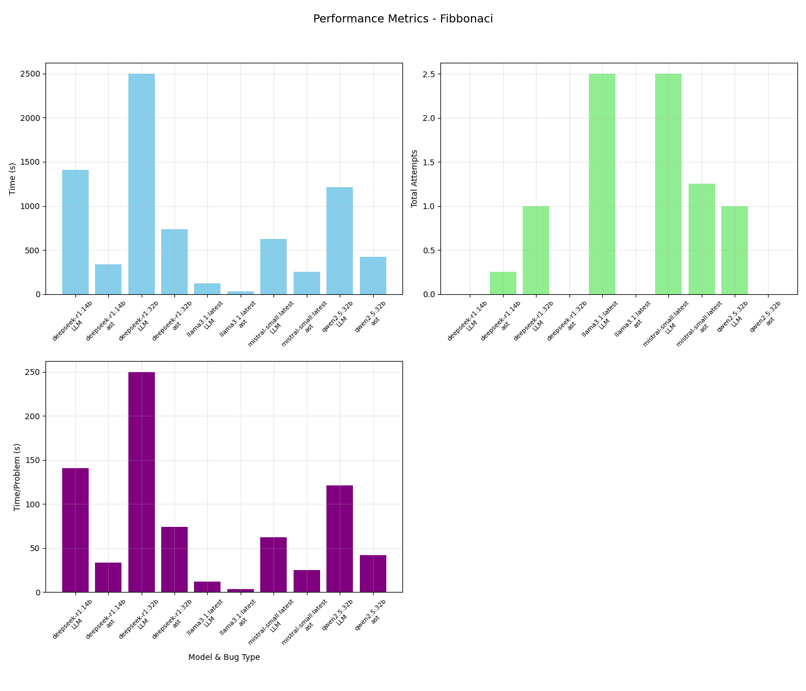

% Debugging Problems
% Author: Patrick Farmer Supervisor: Dr. Jonathon Dukes

# Demonstration

This will contain example code and LLM bug insertion

---

# LLM's

- What LLMs are good at
  - Writing human-like code
- What LLMs are bad at
  - Creating bugs intentionally
- Interacting with LLM in code
  - Interactions with an LLM is done though an API (Ollama or OpenAI)

---

# Debugging Importance

- A large portion of a programmers time is spent debugging 
- The time spent debugging is between 35-50% (1)
- The cost of debugging is between 50-75% (2)
- Increased importance of debugging as LLM usage grows

---

# Skills for Debugging

- Domain and System Knowledge
- Tool knowledge
- Debugging strategies
- Experience

---

# Addressing Debugging

- Greater exposure to python from program + practice understanding problems
- Future front end should include debugging tools
- A user could teach debugging strategies with the tool
- More exposure to bugs particularly in LLMs

---

# Code Architecture

---

# Testing Architecture

---

# Bug Insertion

(Move in front of architecture diagrams?)

- Two types of bug insertion
  - LLM bug insertion
  - AST bug insertion
- The LLM had a lot of issues with bug insertion

---

# Self Checking and Improvement

- Self Checking
  - The code is parsed from the response
  - The code is fed back to the LLM along with prompt
- Self Improvement
  - If all is ok, continue to compilation and test case checking
  - if not, ask LLM to improve the response and try again (up to x times)

---

# Performance across models

---

# Conclusion

- A tool to generate helpful problems for students to debug was created
- The future work could include a front end for the tool and a study to test the usefulness of the tool
- Thank you for listening

# References

1. Britton, T., Jeng, L., Carver, G., Cheak, P., Katzenellenbogen, T. 2013. Reversible debugging software. Cambridge Judge Business School; http://citeseerx.ist.psu.edu/viewdoc/download?doi=10.1.1.444.9094&rep=rep1&type=pdf.
2. RTI. 2002. The economic impacts of inadequate infrastructure for software testing;  http://www.nist.gov/director/planning/upload/report02-3.pdf.
`